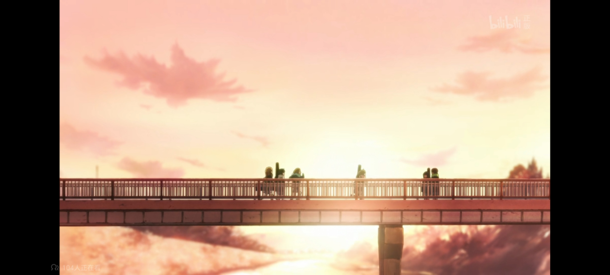

让我们晚一些进入正题吧，我想先聊聊有关我喜欢的番。
但是我想聊的不是那些有口皆碑的神作，而是一些更有争议的动漫。
比如《天气之子》。
关于这部电影，很多人都认为它不如君名，但这并不妨碍我喜欢它。
我喜欢的是它的浪漫。
即使所有人都在劝你说“该长大了”“该变得成熟了”或是“不要再小孩子气了”，可你依旧选择那条最不切实际的路。
这就是它最浪漫的地方。
不切实际，但又触人心弦。

你也可以这么做啊，
把你最喜欢的动漫周边拿出来甩到反对你看番的人的脸上告诉他：
“老子就是喜欢看番怎么了？”
或者别的什么你讨厌的事情也可以。
但你做不到对吗？
毕竟森岛帆高尚且有一把枪，
而你，什么都没有。
你这么做的唯一后果就是被老师或家长劈头盖脸的骂上一顿。
所以浪漫终究止于浪漫，
触人心弦终究止于心弦。
这不是说光有所谓的勇气就能解决的事情。
这是整个社会的压迫。
与此相符的，帆高在面对压迫时选择了反抗，而你选择了妥协。
这就是为什么那边才是动漫。
你看动漫不是去照镜子的，是去给自己找一片可供栖息的净土的。
你这是在逃避啊。
那或许到这里，我想诉说的内容也就明了。
我们之所以看动漫，
就是为了逃避。
这也就是，迎着日光的盛大逃亡。

你对世界有所不满却又无可奈何。
难道你不想改变吗？
想啊，但你早就过了那个肆意妄为的年纪了。
你长大了。
而就在这时，你遇见了属于另一个次元的光。
沉沦会是理所当然的。
毕竟至少在那个世界，永远都会有那些黑暗中默默抱紧你的人，逗你笑的人，陪你彻夜聊天的人，坐车来看望你的人，带着你四处游荡的人，说想念你的人。
而正如村上春树所说，
就是她们，组成了你生命中一点一滴的温暖。
也是她们，让你成为了一个温柔的人。

迎着日光 盛大逃亡   
在这条路上，尽管你也是在反抗着世界，但没有小怪兽陪着你，当你离开时自然也没有人会用十万张花票挽留你。
你没有朗基努斯之枪，也永远无法打破他人的AT力场。
尽管迎着日光，但是形单影只。
你在途中会经历许许多多有趣的事，也会遇到很多不如人意的意外。
但总的来说，这会是一次……浪漫的旅程。
可你的逃亡一定有终点。
在那最后的最后，无论你经历了什么，你现在都到了这里。
你会回首过往的一切。
落日发红，斜斜的阳光从树荫间投下来。
老旧的电车载着你所有的回忆，发出咯噔咯噔的声音。
它的终点站会是你记忆的最深处，
或许在你酩酊大醉时会追忆，或许你再也不会想起它。
这是场无声的告别。
最终你会提起公文包，继续工作和生活。
好像一切都没有变。

这就是我们都会抵达的终点。
你现在是什么感觉，
遗憾、无奈、悲伤，抑或兼而有之？
那么，我们为何热爱二次元？
不仅仅是为了迎着日光盛大逃亡，也是为了这最终的结局。
一段旅程的意义，不仅在于过程，还在于结尾
与她们的一切早就留在了你的心底，
抹不去，忘不掉。
在你结束逃亡时，她们会笑着与你挥手告别。
因为她们的不舍与释然。
不舍在于，你最终必然会踏上新的旅程，并与你之前热爱的所有道别。
但是，她们会释然，
并祝福你遇见更美好的一切。
所以在你再次启程前，她们会把最好的一面展示出来，留下一句“一路顺风”作为道别。
——尽管你可能听不见了。
为了她们，
这就是结局的意义。
